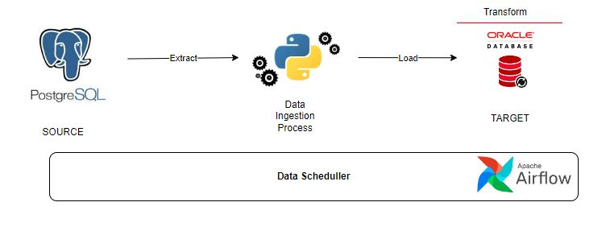

# [Project 1: Sync News Data Into Datawarehouse]
This is a project I did for first project portfolio on GitHub.

* Data was taken from generate realistic data from library 'fakes' in python then imported into the OLTP PostgreSQL database system.
* Capture the entire dataset(data from 2016-2024) from the database to populate the data warehouse initially using Incremental Load.
* Extract data from **PostgresSQL**, Load data using **Python**, Transform data using **Oracle** and Schedule each hour everyday using **Airflow**.
* SCD-4 for ensure that maintain historical data when populating and updating data warehouse for hard delete method on source data.

## Overview of The Data Pipeline Process Architecture  

